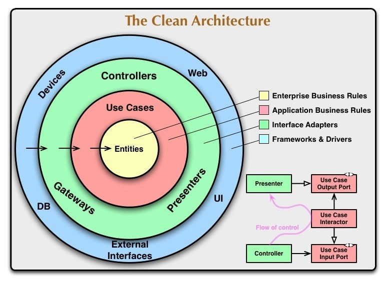

# flutter_tdd and architecture composition using custom packages

A new Flutter project based on Clean Architecture and TDD principles.

:iphone: :man_technologist:

## Getting Started

This project is a starting point for a Flutter application.

A few resources to get you started if this is your first Flutter project:

- [Lab: Write your first Flutter app](https://flutter.dev/docs/get-started/codelab)
- [Cookbook: Useful Flutter samples](https://flutter.dev/docs/cookbook)

For help getting started with Flutter, view our
[online documentation](https://flutter.dev/docs), which offers tutorials,
samples, guidance on mobile development, and a full API reference.

---

**Packages Version:**

Dart: 2.7.0

Flutter: Flutter v1.12.13+hotfix.5

- For state management -> Bloc: flutter_bloc 3.1.0
- For service locator -> get_it 3.1.0
- For equality -> equatable 1.0.2
- For functional programming -> dartz: 0.8.9
- For remote API -> data_connection_checker: 0.3.4 and http 0.12.0+4
- For local cache -> shared_preferences 0.5.6
- For unit testing -> mockito 4.1.1

---

## Clean Architecture Diagram

## Clean Architecture Flutter Diagram

## Create Dart/Flutter package
- https://dart.dev/guides/libraries/create-library-packages
- https://dart.dev/guides/packages

## References

- https://resocoder.com/blog/
- https://resocoder.com/flutter-clean-architecture-tdd
- https://www.youtube.com/watch?v=dc3B_mMrZ-Q&feature=share

- https://resocoder.com/2019/10/26/flutter-bloc-library-tutorial-1-0-0-stable-reactive-state-management/
